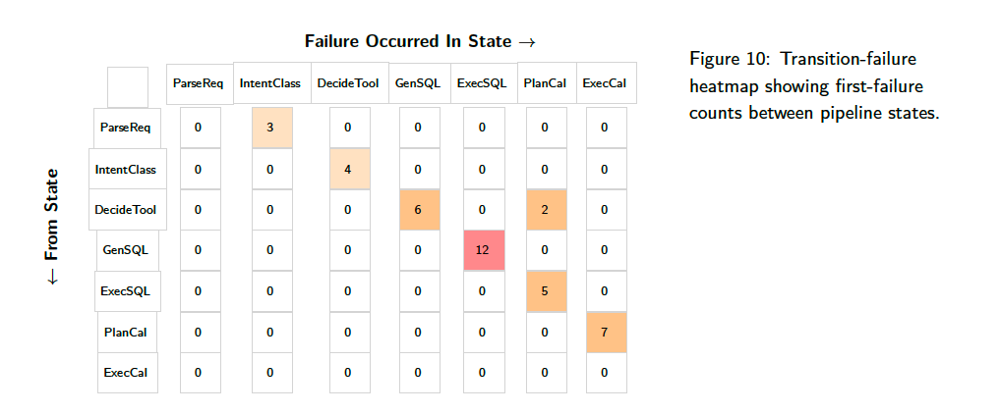

This is both a [Maven online course](https://maven.com/parlance-labs/evals?promoCode=MAVEN100) as well as an accompanying textbook (which you receive if you enrol in the course.)

I attended the first cohort and [gave a guest lecture](https://chrislovejoy.me/ai-evals-in-vertical-industries) on the second cohort.

### Error analysis
- The best data is data that comes directly from customers / from live production data
- When you don't have that, you need to bootstrap synthetic eval data. There's a systematic process for doing so:
	1. Define dimensions of your input query data
	2. Create tuples across those dimensions
	3. Generate synthetic examples
- Keep repeating those steps until you have ~100 high quality examples
- You should have a hypothesis for how it will fail before you generate any data
- You need to define 'failure modes' for your product - ways it can go wrong. There's a way to do this:
	1. Generate a list of traces by passing data through your pipeline
	2. For each trace, do a first-pass annotation with a broad description of how it's wrong ("open coding")
	3. Go and review those annotations to generate a taxonomy of failure modes ("axial coding")
- Repeat this process a few times until you have a failure mode taxonomy you think is descriptive. Over time, you'll keep iterating and improving this based on new data coming in.

### Collaborative Evaluation Practices
- You need to align on what is the 'correct' answer (i.e., what's the ground truth)
- It's recommended to have 1 person do this, so that there is consistency
- As different people form annotation, you want to measure inter-annotator agreement. Use cohen's kappa to account for chance agreements

### Automated Evaluators
- Automating some of your evaluators (either programmatically or via LLM-as-judge) helps scale you monitoring
- You want both a reference-free and reference-based evaluator for all known failure modes
- Highly encourage to use fewshot prompting in LLM-as-judge
- When developing LLM as judge evaluators, the train/dev/test split is still relevant but the ratios have changed from traditional ML:
	- In traditional ML, you use 40/40/20. In LLM world, you can use more like 20/40/40.
	- You use the training set to identify few-shot examples for your LLM as judge, development set to tweak the prompting (but don't add few-shot examples from dev set to avoid overfitting) then test final performance on test set

### Evaluating multi-turn conversations
- Assess multi-turn evaluation at three levels:
	- Session level - whether achieves users end goal (pass/fail)
	- Turn level - quality of each response (relevance, correctness, tone, etc)
	- Conversational coherence and memory - is knowledge retained appropriately across multiple turns

### Specific Architectures and Data Modalities

- Special cases of evaluation include tool use, agents, multi-step pipelines and specific data inputs
- (outline a framework for tool use assessment)
- For multi-step pipelines, the key is to use tracing to understand where you're going wrong
- For more open-ended tasks (such as agentic and multi-step pipelines), it's helpful to define the 'states' that the LLM pipeline can pass between (e.g., "calling weather", "deciding next step").
- You can map these defined 'states' it into a matrix as a "transition-failure heatmap" aka a "failure funnel", to see where your pipeline is going wrong:

<!-- %% TODO: chapters 9, 10 and 11 %% -->

